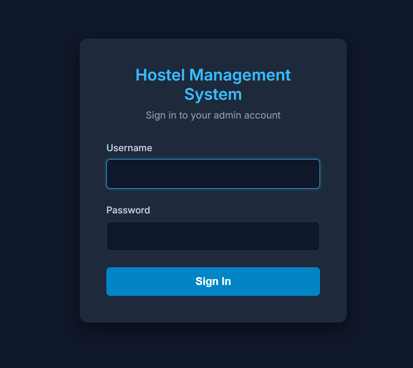
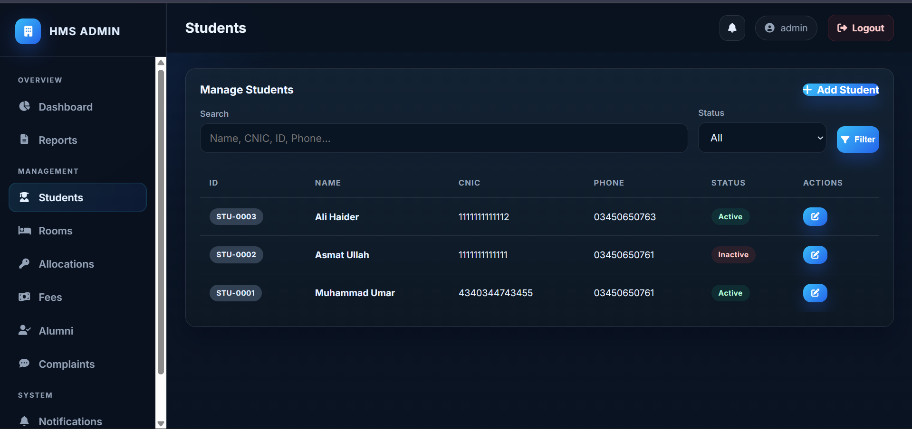
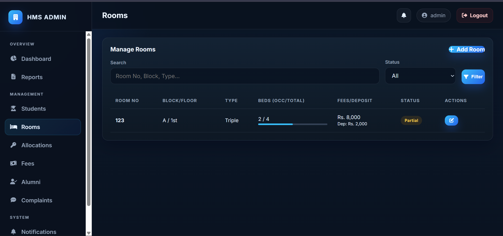
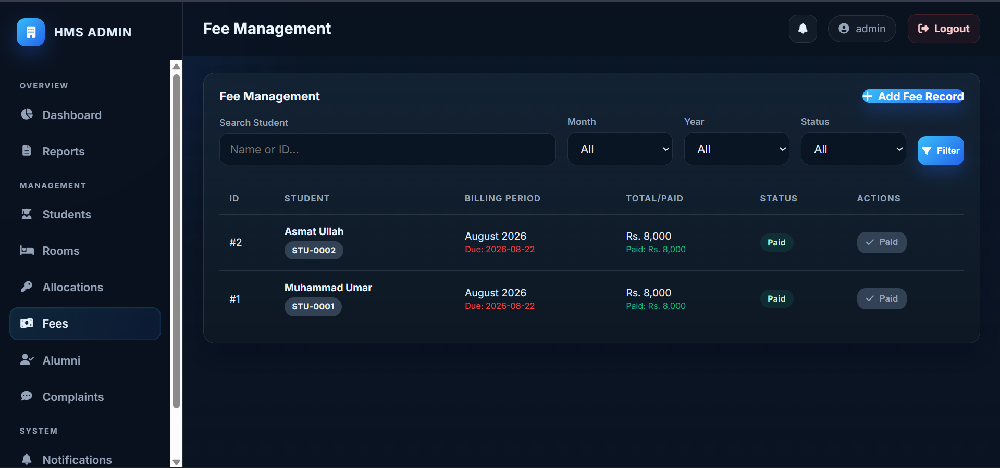
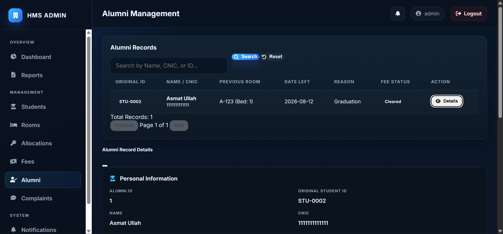
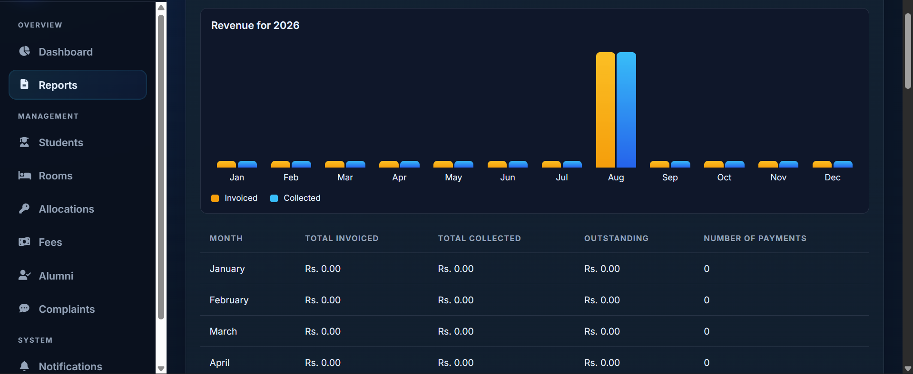
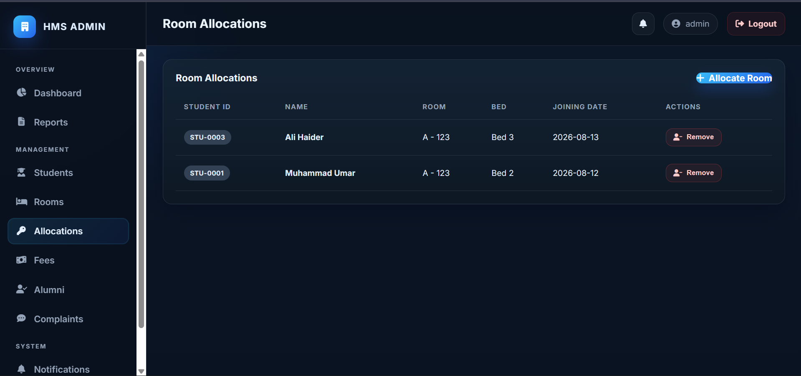

# 🏨 Hostel Management System

A complete web-based Hostel Management System built using PHP, MySQL, HTML, CSS and JavaScript.

## ✨ Features

- 🔐 Secure Admin Authentication
- 📊 Admin Dashboard
- 👨‍🎓 Student Management
- 🏠 Room & Bed Allocation
- 💰 Fee Management
- 📜 Student History
- 🎓 Alumni Management
- 🔎 Student Search
- 📱 Responsive Web Interface
- 🗄️ MySQL Database
- 🔒 PDO-based Database Access
- 🧩 MVC Architecture

## 🛠️ Technologies Used

- PHP
- MySQL
- HTML5
- CSS3
- JavaScript
- PDO
- MVC Architecture
- XAMPP

## 📸 Screenshots

### 🔐 Login


### 📊 Dashboard


### 👨‍🎓 Student Management


### 🏠 Room Management


### 💰 Fee Management


### 💰 Fee Management



### 💰 Fee Management



### 💰 Fee Management

## 🗄️ Database

The application uses MySQL with a normalized relational database architecture.

Main tables include:

- `admins`
- `students`
- `rooms`
- `room_allocations`
- `fee_records`
- `student_history`
- `alumni`
- `system_logs`

## 🚀 Local Setup

### Requirements

- XAMPP
- PHP 8+
- MySQL 8+
- Web Browser

### Installation

1. Clone the repository.

2. Place the project inside:

```text
xampp/htdocs/
```

3. Point Apache's `DocumentRoot` at the repository's `public/` directory. The PHP entry point loads application code from outside that web root; database dumps, configuration, logs, and MVC source remain non-public.

4. For local XAMPP, set these environment values for Apache (for example, with `SetEnv` in the local Apache configuration):

```text
HMS_ENV=development
HMS_DB_HOST=localhost
HMS_DB_NAME=hms_db
HMS_DB_USER=root
HMS_DB_PASSWORD=
```

5. In production, set `HMS_ENV=production` and provide non-root credentials through `HMS_DB_HOST`, `HMS_DB_NAME`, `HMS_DB_USER`, and `HMS_DB_PASSWORD`. The application refuses production database configuration when any value is missing or the database user is `root`.